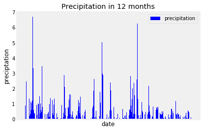
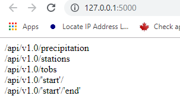
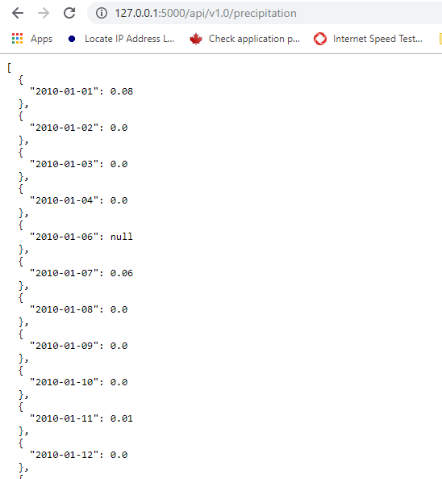
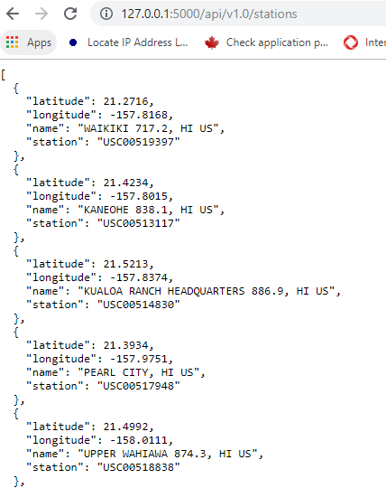
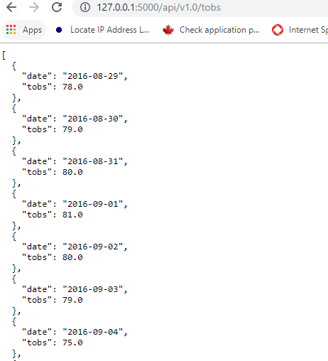
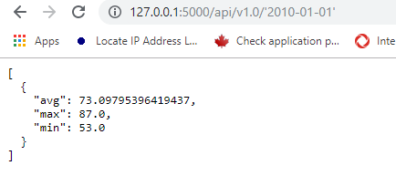
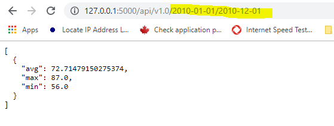

# Climate-Analysis
Python: SQLAlchemy and Flask (API)

There are two parts in this probject, the first one is Climate Analysis and Exploration. And the second one exposes the database content using API with Flask

1. Firt part: Climate Analysis and Exploration
Import SQLite:
```Python
# Python SQL toolkit and Object Relational Mapper
import sqlalchemy
from sqlalchemy.ext.automap import automap_base
from sqlalchemy.orm import Session
from sqlalchemy import create_engine, func,inspect

engine = create_engine("sqlite:///Resources/hawaii.sqlite")


```

This code mapping automaticaly the tables and columns inside the SQLite:

```Python
# reflect an existing database into a new model
Base = automap_base()
# reflect the tables
Base.prepare(engine, reflect=True)
```

```Python
# Save references to each table
Measurement = Base.classes.measurement
Station = Base.classes.station
```

```Python
session = Session(engine)
```
Instead to create sql statement, it is possible to use SQLAlchemy which abstract the way to do queries in any kind of database. 


```Python
most_active = session.query(Measurement.station, func.count(Measurement.station)).\
                            group_by(Measurement.station).\
                            order_by(func.count(Measurement.station).desc()).all()
```

Using matplotib is possible to plot results, for instance, this one shows the preciptation in 12 months<br>


To see more analysis, go to jupyter notebook python code, or just click [here](climate_starter.ipynb)

2. Second part: Climate App<br>
design a Flask API based on the queries

## Routes
```
/
```
*Home page.<br>
List all routes that are available.


```
/api/v1.0/precipitation
```


Convert the query results to a Dictionary using date as the key and prcp as the value.
Return the JSON representation of your dictionary.

```
/api/v1.0/stations
```
Return a JSON list of stations from the dataset.



```
/api/v1.0/tobs
```


query for the dates and temperature observations from a year from the last data point.
Return a JSON list of Temperature Observations (tobs) for the previous year.

```
/api/v1.0/<start>
```  

  
```
/api/v1.0/<start>/<end>
```


Return a JSON list of the minimum temperature, the average temperature, and the max temperature for a given start or start-end range.
When given the start only, calculate TMIN, TAVG, and TMAX for all dates greater than and equal to the start date.
When given the start and the end date, calculate the TMIN, TAVG, and TMAX for dates between the start and end date inclusive


